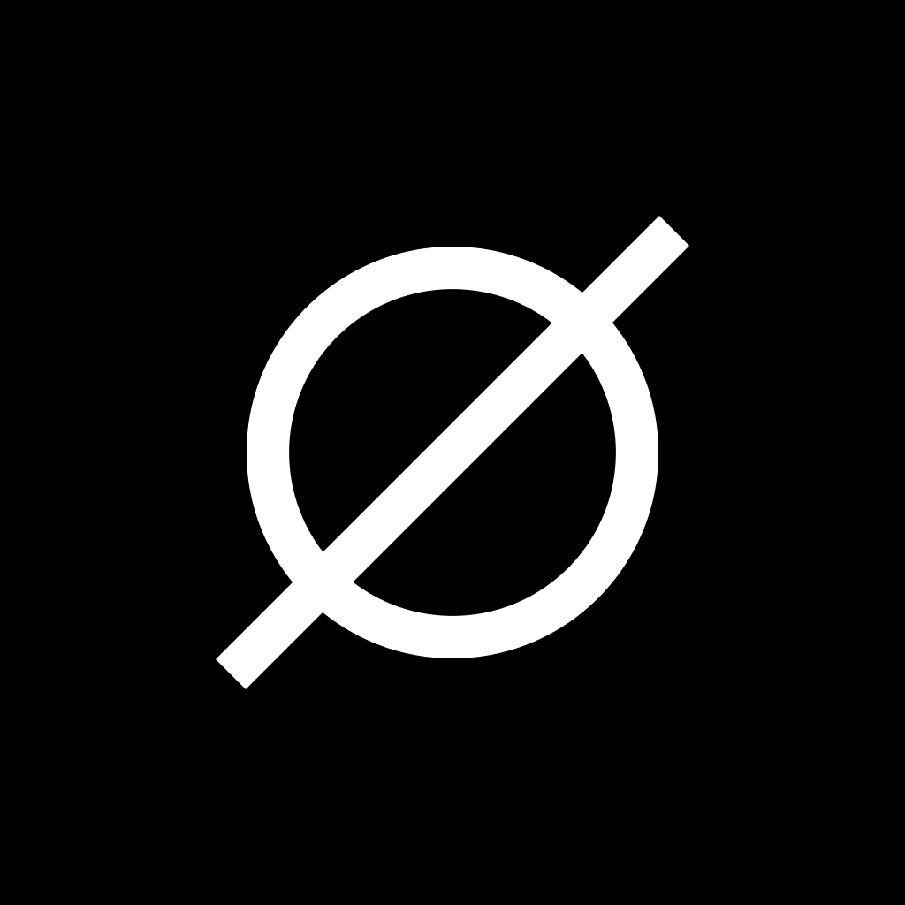
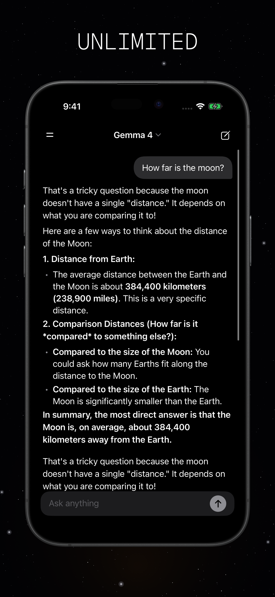

<div align="center">
  

# Silo

### private on-device ai chat for ios — llama.cpp, metal gpu, gguf models, no cloud

[Available on the App Store](https://apps.apple.com/us/app/silo-private-ai-assistant/id6741248135)

</div>

<br />

## 📱 Demo

<div align="center">
  
</div>

<br />

## 🚀 Quick Start

```bash
git clone https://github.com/stevederico/silo.git
cd silo
cd /tmp && git clone https://github.com/ggml-org/llama.cpp.git
cd llama.cpp && ./build-xcframework.sh
cp -R build-apple/llama.xcframework <path-to-silo>/
open Silo.xcodeproj
```

Build and run on an iPhone or simulator running iOS 18.2+.

<br />

## ✨ Features

### 🔒 **Privacy**
- **Zero network requests** — inference runs entirely on device
- **No accounts** — no login, no email, no signup
- **No tracking** — no analytics, no telemetry, no data collection
- **Works offline** — airplane mode, subway, off-grid

### 🧠 **Models**
- **Gemma 4 E2B** from Google (Q4 default, Q8 optional)
- **Gemma 3** 1B and 4B from Google — light and balanced on-device sizes
- **Llama 3.2 3B** from Meta, **Phi-4 Mini** from Microsoft, **Ministral 3B** from Mistral
- **LFM 2.5** from Liquid AI — fast 1.2B instruct model
- **Bring your own GGUF** from any Hugging Face URL

### 💬 **Chat**
- **Streaming markdown** with bold, headers, code blocks, nested lists
- **Conversation history** stored locally, never uploaded
- **Uncensored** — the model answers, the app does not filter
- **System prompt editor** for custom behavior

### ⚡ **Performance**
- **Metal GPU acceleration** via llama.cpp
- **BF16 compute** on supported hardware
- **Actor-isolated inference** — thread-safe, single model loaded at a time
- **Download resume** and corrupt file detection

<br />

## 🧩 Architecture

Swift actor wraps llama.cpp for thread-safe inference. One model loaded at a time. Backend ref counting prevents double-init. Model-specific chat templates fall back to `llama_chat_apply_template()` then ChatML. Streaming output passes through `SpecialTokenFilter` and `ThinkTagStripper` before rendering in a memoized block-level markdown view.

```
Silo/
├── Inference/     # LibLlama actor, engine protocol, format detector
├── UI/            # ContentView, LlamaState, ConversationManager
│   └── Components # MessageBubble, MarkdownText, DrawerView, HeaderView
└── SiloApp.swift
```

<br />

## 🛠️ Tech Stack

| Technology | Version | Purpose |
|---|---|---|
| **Swift / SwiftUI** | 5.9+ | UI and app lifecycle |
| **llama.cpp** | latest | GGUF inference engine |
| **Metal** | — | GPU acceleration |
| **iOS** | 18.2+ | Minimum deployment target |

<br />

## 🧪 Build

```bash
xcodebuild -project Silo.xcodeproj -scheme Silo \
  -destination 'platform=iOS Simulator,name=iPhone 17 Pro' build
```

`llama.xcframework` is gitignored. Rebuild from source when adding support for new model architectures.

<br />

## 🤝 Contributing

```bash
git clone https://github.com/stevederico/silo.git
cd silo
open Silo.xcodeproj
```

Open an issue before large changes. Keep PRs scoped. Set your own `DEVELOPMENT_TEAM` and `PRODUCT_BUNDLE_IDENTIFIER` before building on a device.

<br />

## 🌍 Community

- **X:** [@stevederico](https://x.com/stevederico)
- **Issues:** [github.com/stevederico/silo/issues](https://github.com/stevederico/silo/issues)

<br />

## 🙏 Acknowledgements

- [llama.cpp](https://github.com/ggml-org/llama.cpp) — inference engine
- [Unsloth](https://huggingface.co/unsloth) — quantized model releases
- [Hugging Face](https://huggingface.co) — model hosting

<br />

## 📄 License

[MIT License](LICENSE)

<br />

<div align="center">
  Built with Swift, llama.cpp, and Metal.
  <br />
  ⭐ Star this repo if Silo keeps your conversations private.
</div>
